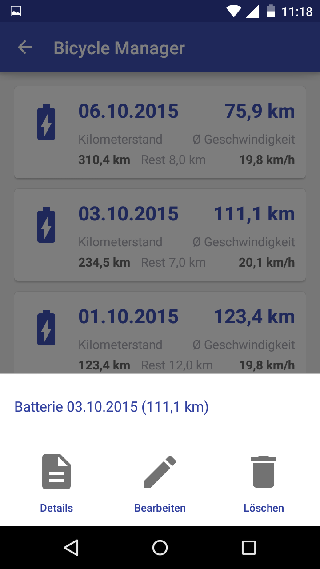
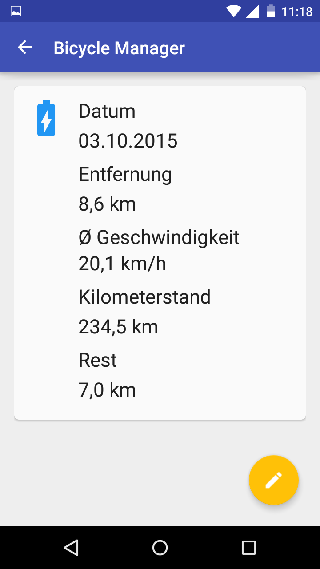

*Cycling is fun and healthy.*


# Bicycle Manager Android

> **Bicycle Manager** is an Android app that I collect the data of my e-bikes. Bought in the spring, I collect the battery capacity.
> At this Android app also includes a REST backend [*"Bicycle Manager Server"*](https://github.com/blueskyfish/bicycle-manager-server.git) that has been programmed with JavaScript and Node JS.
> I plan yet a graphical overview and a route tracker


## Requirements

**For Develop**

* Android Studio <https://developer.android.com/sdk/index.html>

**For Mobile Phone**

* Android 5.0.2 *(Tested on Motorola G 2015 with Android 5.0.2)*


## Screenshots

| Screenshots | | 
|-------------|----
|          | 
|  | 
|  | 


## Setup the BaseURL

The base url for the backend must be configured separably.

First: Create a string resource in the folder `app/src/main/res` (The name of the string resource does not matter).

```xml
<?xml version="1.0" encoding="utf-8"?>
<!--
    This file is not in the git repository !!
-->
<resources>
    <string name="setting_base_url">http(s)://domain/subfolder</string>
</resources>
```


## Third Party Libraries

| Name                                                                                                  | Version    | Licence
|-------------------------------------------------------------------------------------------------------|------------|---------
| com.android.support:appcompat<br><https://developer.android.com/tools/support-library/index.html>     | v7 23.1.0  | Apache License, Version 2.0 
| com.android.support:design<br><https://developer.android.com/tools/support-library/index.html>        | 23.1.0     | Apache License, Version 2.0
| com.android.support:cardview<br><https://developer.android.com/tools/support-library/index.html>      | v7 23.1.0  | Apache License, Version 2.0
| com.android.support:recyclerview<br><https://developer.android.com/tools/support-library/index.html>  | v7 23.1.0  | Apache License, Version 2.0
| com.cocosw:bottomsheet<br><https://github.com/soarcn/BottomSheet>                                     | 1.2.0@aar  | Apache License, Version 2.0 
| com.google.guava:guava<br> <https://github.com/google/guava>                                          | 18.0       | Apache License, Version 2.0
| de.blueskyfish:simple-http-client<br><https://github.com/blueskyfish/simple-http-client>              | 0.3.2      | The MIT License (MIT)
| com.fasterxml.jackson.core:jackson-databind<br><https://github.com/FasterXML/jackson-databind>        | 2.6.2      | Apache License, Version 2.0


## History

| Date         | Version | Number | Description
|--------------|---------|--------|-------------------------------
| 2015-10-18   | 1.0.0   | 1      | Initial app.
| 2017-05-12   | 1.1.0   | 2      | update to Android 7.0 (#24)<br>rename the package to "de.blueskyfish"


## License

```
The MIT License (MIT)

Copyright (c) 2017 BlueSkyFish

Permission is hereby granted, free of charge, to any person obtaining a copy
of this software and associated documentation files (the "Software"), to deal
in the Software without restriction, including without limitation the rights
to use, copy, modify, merge, publish, distribute, sublicense, and/or sell
copies of the Software, and to permit persons to whom the Software is
furnished to do so, subject to the following conditions:

The above copyright notice and this permission notice shall be included in
all copies or substantial portions of the Software.

THE SOFTWARE IS PROVIDED "AS IS", WITHOUT WARRANTY OF ANY KIND, EXPRESS OR
IMPLIED, INCLUDING BUT NOT LIMITED TO THE WARRANTIES OF MERCHANTABILITY,
FITNESS FOR A PARTICULAR PURPOSE AND NONINFRINGEMENT. IN NO EVENT SHALL THE
AUTHORS OR COPYRIGHT HOLDERS BE LIABLE FOR ANY CLAIM, DAMAGES OR OTHER
LIABILITY, WHETHER IN AN ACTION OF CONTRACT, TORT OR OTHERWISE, ARISING FROM,
OUT OF OR IN CONNECTION WITH THE SOFTWARE OR THE USE OR OTHER DEALINGS IN
THE SOFTWARE.
```